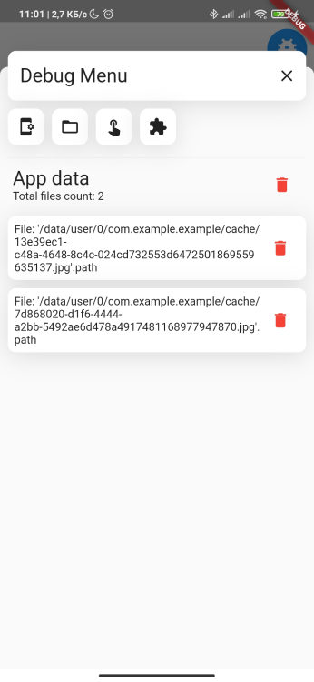
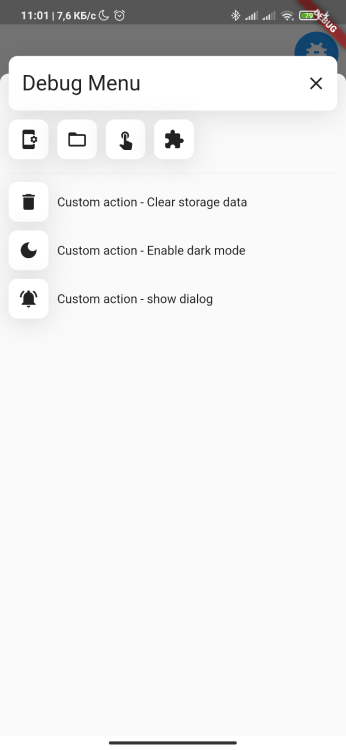

<div align="center">
    <h1>Debug Friend</h1>
</div>
<h2 align="center">Flutter debug helper widget with common and custom actions</h2>
<p align="center">
    This helps you reduce the development and testing time of new features
   <br>
   <span style="font-size: 0.9em"> Show some ❤️ and <a href="https://github.com/Frezyx/debug_friend">star the repo</a> to support the project! </span>
</p>
<br>

|  |  |  |  |  | 
| :------------: | :------------: | :------------: | :------------: |  :------------: |

## Main features

- Check device info & package info
- Viewing and managing application cache
- Flutter inspector features
- Test your custom actions

## Quickstart

Wrap your MaterialApp's home or builder widget in a DebugFriend.

```dart
import 'package:debug_friend/debug_friend.dart';
import 'package:flutter/material.dart';

void main() {
  runApp(
    MaterialApp(
      home: DebugFriendView(
        builder: (context) {
          return const Scaffold(
            body: Text('Your app home widget'),
          );
        },
      ),
    ),
  );
}
```